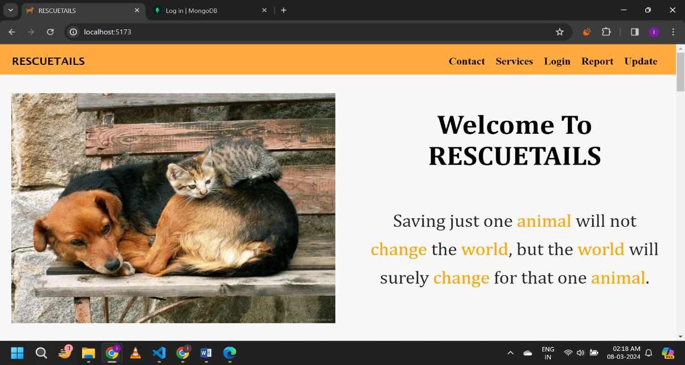
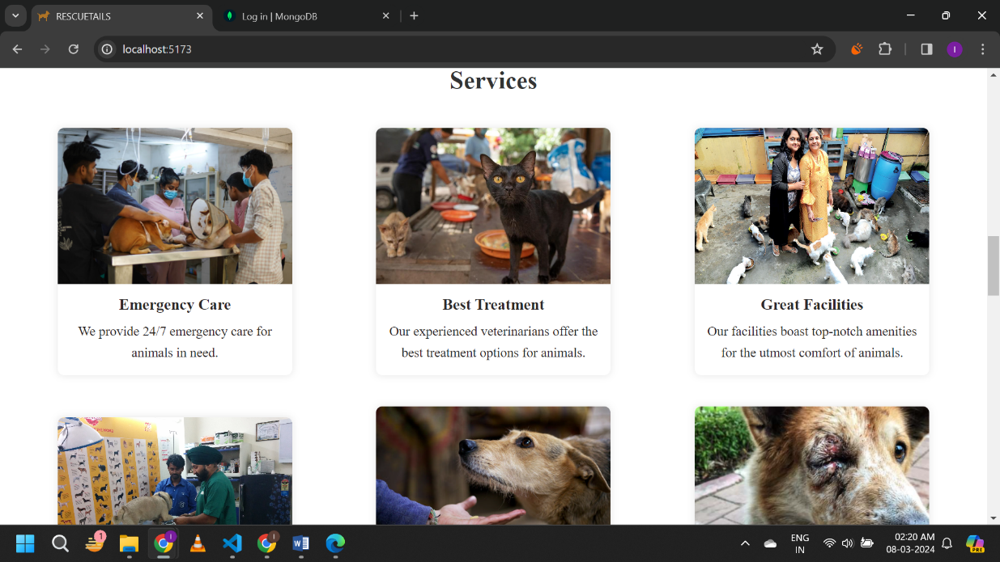
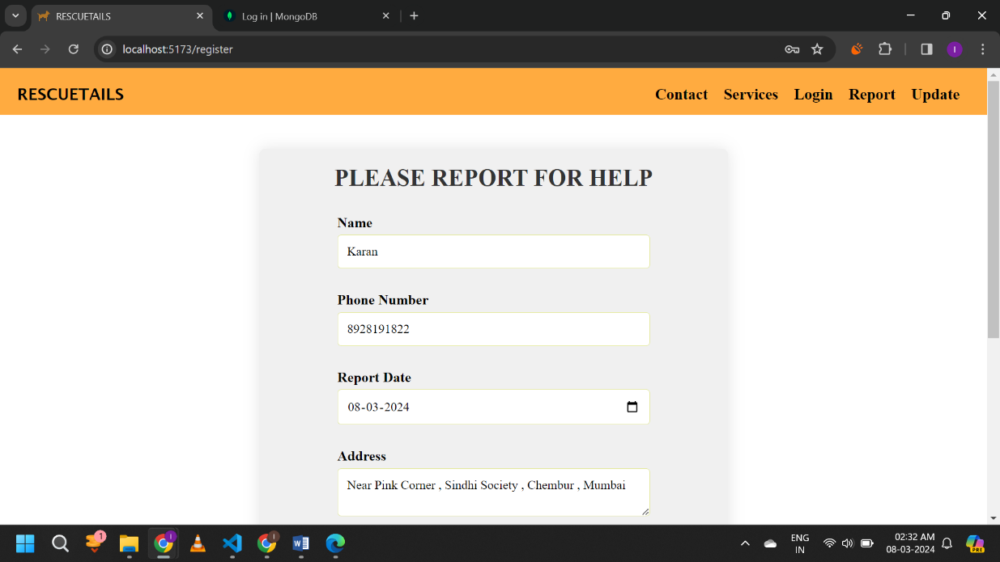
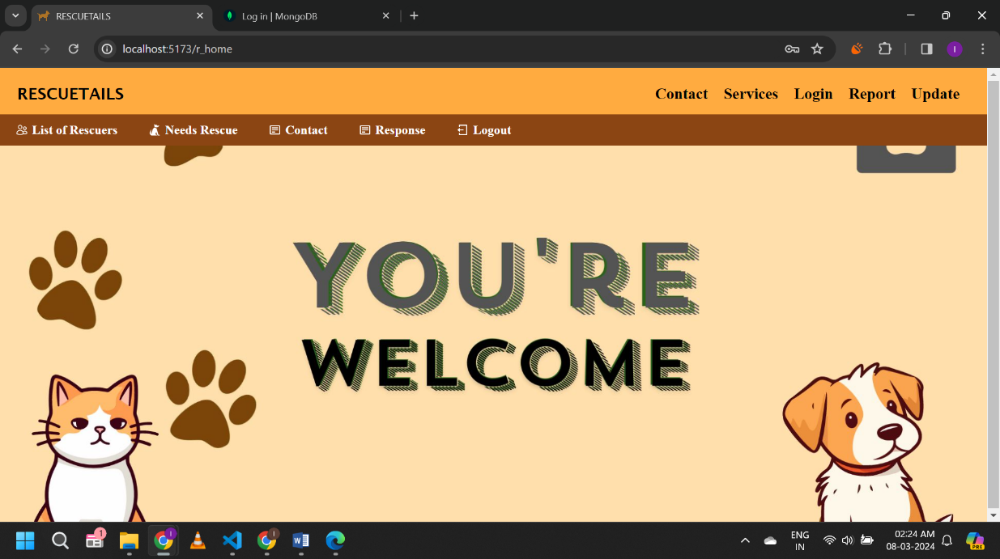
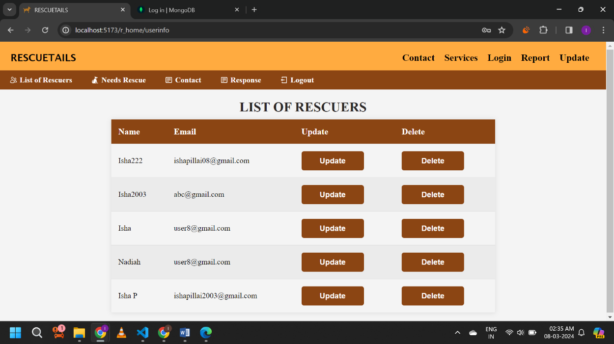
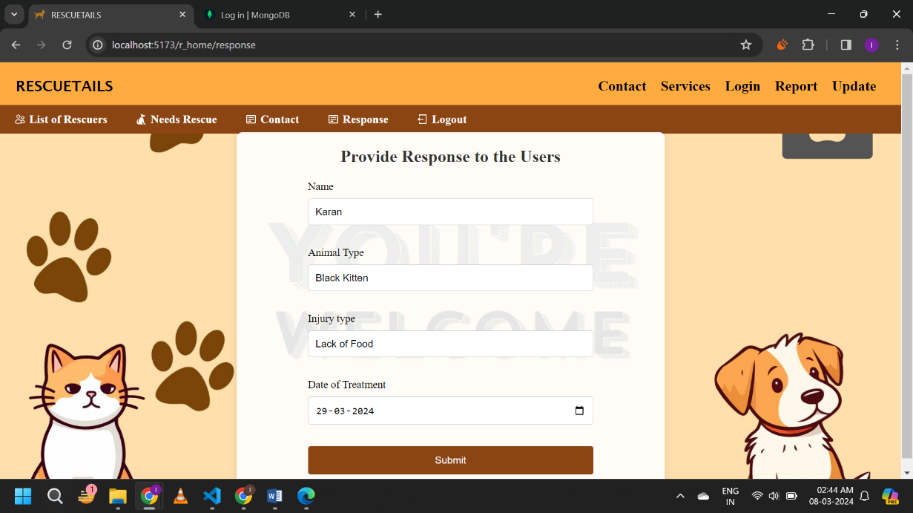
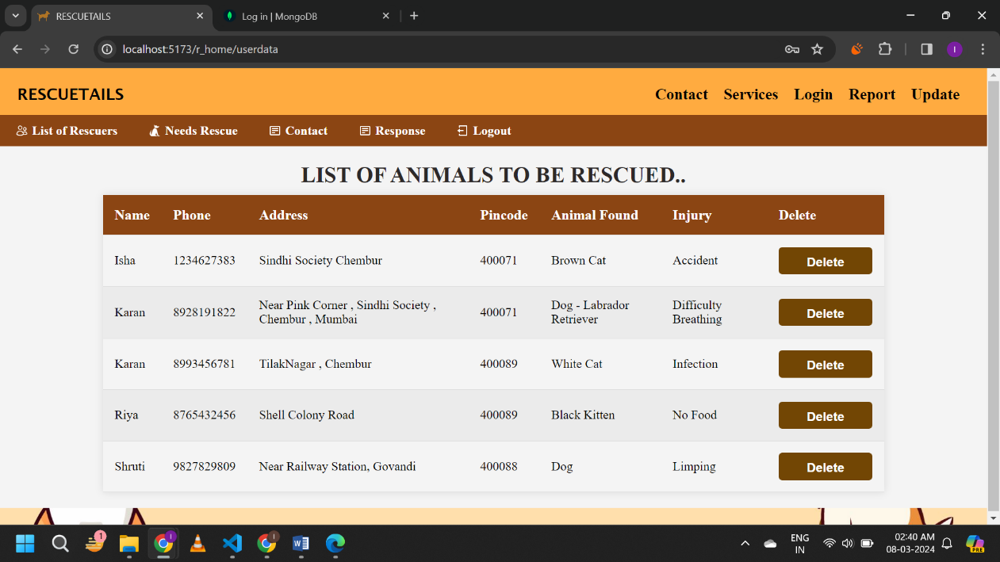
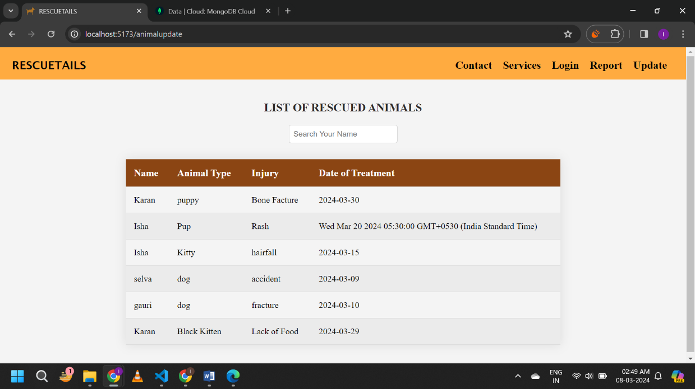

# 🐾 RescueTails – Stray Animal Rescue System

**RescueTails** is a web-based stray animal rescue management system designed to connect people who find animals in need with rescuers who can provide assistance, treatment, and rescue services.

The system provides separate functionality for users and rescuers to manage rescue requests, animal information, responses, and rescued-animal records.

## ✨ Features

- 🐾 Report animals requiring rescue or medical assistance
- 👤 User registration and login
- 👩‍⚕️ Rescuer registration and management
- 📋 View reported animals
- 📝 Manage animal information
- 💬 Provide rescue/treatment responses
- ✅ Maintain rescued-animal records
- 📞 Manage user contact information
- 🔄 Update user and animal details
- 🏥 Display animal-care services

## 🛠️ Technologies Used

### Frontend
- React.js
- JavaScript
- HTML
- CSS
- Vite

### Backend
- Node.js
- Express.js

### Database
- MongoDB

### Tools
- Visual Studio Code
- Git
- GitHub

## 📂 Project Structure

```text
RescueTails/
│
├── client/
│   ├── public/
│   └── src/
│       ├── components/
│       ├── layouts/
│       └── pages/
│
├── server/
│   ├── controllers/
│   ├── model/
│   ├── router/
│   └── server.js
│
├── docs/
│   └── screenshots/
│
├── .gitignore
├── package.json
└── package-lock.json
```

## 🖥️ Application Screenshots

### 🏠 Home Page

The RescueTails home page introduces the platform and provides navigation to the major sections.



### 🩺 Services

The services page displays information about animal-care and rescue facilities.



### 🚨 Report an Animal

Users can submit details about animals requiring help, including contact information, report date, and location.



### 👩‍⚕️ Rescuer Dashboard

The rescuer dashboard provides access to rescue-related management functions.



### 👥 Rescuers List

Registered rescuers can be viewed and managed through the application.



### 🐾 Animals Reported for Rescue

The system displays reported animals along with information such as animal type, location, and injury.



### 💬 Response Management

Rescuers can provide responses regarding the treatment or rescue of reported animals.



### ✅ Rescued Animals

The system maintains records of animals that have been rescued or treated.



## 🎯 Project Objective

The objective of RescueTails is to provide a centralized platform for managing stray-animal rescue activities.

It helps organize:

- Rescue requests
- User information
- Rescuer information
- Animal details
- Treatment/rescue responses
- Rescued-animal records

## 🚀 Future Enhancements

- Real-time rescue request notifications
- Location-based rescue tracking
- Image upload for reported animals
- Rescuer availability tracking
- Adoption management
- Email/SMS notifications
- Mobile-responsive improvements
- Cloud deployment

## 👩‍💻 Author

**Isha Pillai**

MCA – SNDT Women's University

GitHub: **[@Ishaa80](https://github.com/Ishaa80)**
